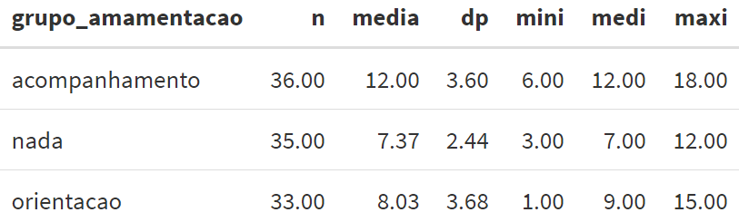
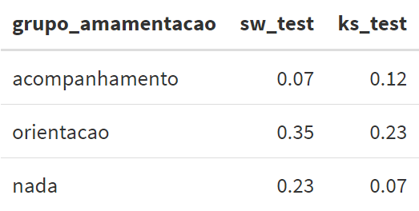

# Testes paramétricos para média {#param}

Nesse capítulo, vamos discutir alguns testes de hipóteses para média. 
Usaremos aqui já as informações sobre testes de hipóteses e intervalos de confiança apresentadas em https://daslab-ufes.github.io/materiais/ no arquivo "Inferência Estatística".

## Teste para média de população única

Seja $\mu$ a média de uma variável quantitativa e queremos testá-la a um valor de referência $\mu_0$. O teste de hipóteses para a média de uma população é conhecido como  **teste t de amostra única**.

Como exemplo, considere que a obstetra do estudo dos gemelares acredita que a media do colo média de gestações gemelares brasileiras é menor que a 
média americana, conhecida ser de 27mm. 

Aqui, $\mu$ é a média da medida do colo de gestações gemelares brasileira e o valor de referência é $\mu_0=27$. São as hipóteses:  $H_0: \mu\geq 27$ e $H_1: \mu< 27$. 

Para realizar o teste t de amostra única, a distribuição da variável quantitativa deve seguir uma distribuição normal ou ter um tamanho da amostra grande. Neste último caso, é importante avaliar se há valores atípicos que possam interferir individualmente nas conclusões inferenciais. 


Primeiramente, vamos carregar os pacotes que usaremos aqui. 
```{r, eval=TRUE,include=TRUE,echo=TRUE,error=FALSE,message=FALSE}
library(readr) #leitor da base de dados csv
library(dplyr) #para manipulação de dados
library(tidyr) #para mudar formato da base de dados
library(summarytools) #para medidas descritivas
library(modelsummary) #para medidas descritivas
library(ggplot2) #para graficos
library(esquisse) #para graficos
library(car) ## para teste de Levene
library(nortest) ## para testes de normalidade
```

Agora vamos importar a base de dados gemelares:

```{r, eval=TRUE,include=TRUE,echo=TRUE,error=FALSE,message=FALSE}
dados <- read_csv(file = "dataset/dados_completos.csv")
```


Primeiro estudamos a distribuição da variável "medida do colo" no que segue:

```{r, eval=TRUE,include=TRUE,echo=TRUE,error=FALSE,warning=FALSE,message=FALSE}
descr(dados$medida_colo,stats = c("n.valid","min", "mean", "med","sd","max"), transpose = TRUE)
```

```{r, eval=TRUE,include=TRUE,echo=TRUE,error=FALSE,warning=FALSE,message=FALSE}
ggplot(dados) +
  aes( y = medida_colo) +
  geom_boxplot(fill = "#0c4c8a") +
  theme_minimal()
```

Podemos observar que a média e a mediana da medida do colo são próximas e pelo boxplot, a distribuição é aproximadamente simétrica e não há valores atípicos. 


Agora sim, podemos realizar o teste t. No R, a função que realiza o teste t é a `t.test` (não precisa carregar pacote). 

```{r, eval=TRUE,include=TRUE,echo=TRUE,error=FALSE,warning=FALSE,message=FALSE}
t.test(dados$medida_colo,mu=27,alternative = "less")
```
Para realizar o teste t de amostra única, indicamos no primeiro argumento a variável que faremos a análise e usamos o argumento `mu=` para indicar o valor de referência. No argumento `alternative=` indicamos o tipo de teste que será realizado: unilateral à esquerda ("less"), unilateral à direita ("greater") e bilateral ("two.sided"). 


Se quisermos apenas o valor p, podemos pedir que o R retorne apenas ele da seguinte maneira:
```{r, eval=TRUE,include=TRUE,echo=TRUE,error=FALSE,warning=FALSE,message=FALSE}
t.test(dados$medida_colo,mu=27,alternative = "less")$p.value
```

Pelos resultados do teste, há indícios de que a obstetra tem razão. 


## Teste para comparação de médias de dois grupos independentes

Considere agora que temos dois grupos independentes e queremos comparar as médias de uma variável quantitativa de interesse desses dois grupos. Seja $\mu_1$ a média do primeiro grupo e seja $\mu_2$ a média do segundo. O teste de hipóteses para a comparação de médias de dois grupos independentes é conhecido como  **teste t de amostras independentes**.

Como exemplo, queremos comparar os grupos progesterona e placebo com relação ao número de contrações medido na última avaliação antes do parto. 

Assim como no teste para amostra única discutido anteriormente, a distribuição da variável quantitativa deve seguir uma distribuição normal em cada grupo ou ter um tamanho da amostra grande. Neste último caso, é importante avaliar se há valores atípicos que possam interferir individualmente nas conclusões inferenciais. 

Para isso, analisamos primeiramente a distribuição de medida do colo em cada grupo.

```{r, eval=TRUE,include=TRUE,echo=TRUE,error=FALSE,warning=FALSE,message=FALSE}
### Essas funcoes abaixo são auxiliares para calcular as descritivas
#em cenário de presença de dados faltantes
media <- function(x) mean(x, na.rm = TRUE)
medi <- function(x) median(x, na.rm = TRUE)
dp <- function(x) sd(x, na.rm = TRUE)
mini <- function(x) min(x, na.rm = TRUE)
maxi <- function(x) max(x, na.rm = TRUE)
n <- function(x) sum(!is.na(x))
```


```{r, eval=FALSE,include=TRUE,echo=TRUE,error=FALSE,warning=FALSE,message=FALSE}
datasummary(grupo~num_contra_ctg*(n+media+dp+mini+medi+maxi), data = dados)
```

```{r, eval=TRUE,include=TRUE,echo=TRUE,error=FALSE,warning=FALSE,message=FALSE}
ggplot(dados) +
 aes(x = "", y = num_contra_ctg, fill = grupo) +
 geom_boxplot() +
 scale_fill_hue() +
 theme_minimal()
```

Podemos observar que há um outlier no grupo progesterona. Para avaliar se esse ponto é decisivo nas conclusões inferenciais, vamos realizar o teste t com e sem esse ponto. 

A função para realizar o teste t é novamente a `t.test`, mas com argumentos diferentes. Um deles é o `var.equal=`, em que `var.equal=TRUE` se as variâncias dos dois grupos forem iguais e `var.equal=FALSE`, caso contrário. Para saber qual informar na função, vamos primeiro realizar o teste de Levene para a comparação das variâncias dos dois grupos. A hipótese nula do teste é de igualdade de variâncias e no R, a função é `leveneTest` do pacote `car`. 

```{r, eval=TRUE,include=TRUE,echo=TRUE,error=FALSE,warning=FALSE,message=FALSE}
leveneTest(num_contra_ctg~grupo,data=dados,center=mean) 
```

Note que usamos o símbolo $\sim$ na função para indicar que queremos a análise do "num_contra_ctg" por "grupo" e que vamos também utilizar na função `t.test`. Ao observar o valor p do teste de Levene, há indícios para considerar variâncias iguais. Logo, vamos para o teste t:
```{r, eval=TRUE,include=TRUE,echo=TRUE,error=FALSE,warning=FALSE,message=FALSE}
t.test(num_contra_ctg~grupo,data=dados,var.equal=TRUE,alternative ="two.sided")
```
Pelo teste t, não há indícios para dizer que os grupos diferem em média no número de contrações. Agora vamos refazer as análises, sem considerar o valor atípico. 

```{r, eval=TRUE,include=TRUE,echo=TRUE,error=FALSE,warning=FALSE,message=FALSE}
dados1 <- filter(dados,num_contra_ctg<max(num_contra_ctg)) 
```

```{r, eval=TRUE,include=TRUE,echo=TRUE,error=FALSE,warning=FALSE,message=FALSE}
leveneTest(num_contra_ctg~grupo,data=dados1,center=mean) 
```

 Ao observar o valor p do teste de Levene, há também indícios para considerar variâncias iguais. Logo, vamos para o teste t:
```{r, eval=TRUE,include=TRUE,echo=TRUE,error=FALSE,warning=FALSE,message=FALSE}
t.test(num_contra_ctg~grupo,data=dados1,var.equal=TRUE,alternative ="two.sided")
```

Pelo teste t, não há indícios para dizer que os grupos diferem em média em relação ao número de contrações, sendo a mesma conclusão inferencial com todas as observações. Logo, o ponto atípico não interferiu na conclusão inferencial. 


## Teste para comparação de médias de dois grupos dependentes

Considere agora que temos dois grupos dependentes e queremos comparar as médias de uma variável quantitativa de interesse desses dois grupos. A dependência entre os grupos pode ser devido a avaliar os mesmos indivíduos em dois momentos: antes e depois de uma intervenção. 

Como exemplo, queremos comparar o escore médio de EPDS (depressão) antes e depois do parto. Seja $\mu_A$ a média do escore do EPDS antes e seja $\mu_D$ a média do EPDS depois do parto. Queremos testar as seguintes hipóteses: $H_0: \mu_A=\mu_D$ versus $H_0: \mu_A \neq \mu_D$. O teste de hipóteses para a comparação de médias de dois grupos dependentes é conhecido como  **teste t de amostras pareadas**.  

Antes de realizar o teste t para amostras pareadas, a distribuição da variável quantitativa nos dois momentos deve seguir uma distribuição normal ou ter um tamanho da amostra grande. Neste último caso, é importante avaliar se há valores atípicos que possam interferir individualmente nas conclusões inferenciais. Para isso, fazemos as seguintes análises exploratórias:


```{r, eval=FALSE,include=TRUE,echo=TRUE,error=FALSE,warning=FALSE,message=FALSE}
datasummary(grupo~num_contra_ctg*(n+media+dp+mini+medi+maxi), data = dados)
```

Para fazer um gráfico boxplot de EPDS antes e depois, precisamos arrumar o formato da base de dados. Utilizamos a função `gather` do pacote `tidyr` (veja em \@ref(formato)). 


```{r, eval=TRUE,include=TRUE,echo=TRUE,error=FALSE,warning=FALSE,message=FALSE}
dados_epds <-  gather(data=dados, key ="momento", value = "epds",
                      epds_antes, epds_depois)
dados_epds <- select(dados_epds,id,momento,epds) 
#selecionando só as colunas que vamos utilizar para fazer o grafico
dados_epds
```

Agora sim podemos fazer o gráfico:

```{r, eval=TRUE,include=TRUE,echo=TRUE,error=FALSE,warning=FALSE,message=FALSE}
ggplot(dados_epds) +
 aes(x = "", y = epds, fill = momento) +
 geom_boxplot() +
 scale_fill_hue() +
 theme_minimal()
```

Podemos observar que, apesar da distribuição do EPDS nos dois momentos não ser muito simétrica, não há valores atípicos em nenhum momento. Vamos então fazer o teste t de amostras pareadas no R:

```{r, eval=TRUE,include=TRUE,echo=TRUE,error=FALSE,warning=FALSE,message=FALSE}
t.test(dados$epds_depois,dados$epds_antes,paired=TRUE) 
```

Veja que para o teste de amostras pareadas, usamos o argumento `paired=TRUE`. 
Ao analisar o valor p do teste, há indícios de mudança no escore médio de EPDS entre os momentos antes e depois do parto.

## Teste para comparação de mais de dois grupos independentes


Em um cenário que queremos comparar as médias de uma variável quantitativa de três ou mais grupos independentes, o teste estatístico é a **Análise de Variância - ANOVA**.

Como exemplo, queremos comparar os três grupos de orientação sobre amamentação no pré-natal (acompanhamento, só orientação e nenhuma orientação) em relação ao tempo de amamentação. Seja $\mu_1$, $\mu_2$ e $\mu_3$ as médias do tempo de amamentação dos grupos acompanhamento, só orientação e nenhuma orientação, respectivamente. São as hipóteses que queremos testar: $H_0:\mu_1=\mu_2=\mu_3$ e $H_1: \mu_i\neq \mu_j$, com $i\neq j$ e $i,j=1,2,3$.

Vamos primeiramente realizar uma análise exploratória para a comparação dos grupos com relação ao tempo de amamentação:

```{r, eval=FALSE,include=TRUE,echo=TRUE,error=FALSE,warning=FALSE,message=FALSE}
datasummary(grupo_amamentacao ~ tempo_amamentacao_meses*(n+media+dp+mini+medi+maxi), data = dados)
```

```{r, echo=FALSE,  out.width = '100%'}

```

Observe pela tabela acima que as categorias de grupo de orientação sobre amamentação está em ordem alfabética. No entanto, queremos que a ordem seja: acompanhamento, orientaco e nada. Para informar isso ao R, vamos reorganizar as categorias da seguinte maneira:
```{r, eval=TRUE,include=TRUE,echo=TRUE,error=FALSE,warning=FALSE,message=FALSE}
dados$grupo_amamentacao <- factor(dados$grupo_amamentacao, levels = c("acompanhamento", "orientacao", "nada"))

```


```{r, eval=TRUE,include=TRUE,echo=TRUE,error=FALSE,warning=FALSE,message=FALSE}
ggplot(dados) +
 aes(x = "", y = tempo_amamentacao_meses, fill = grupo_amamentacao) +
 geom_boxplot() +
 scale_fill_hue() +
 theme_minimal()
```

Para a realização a ANOVA, existem alguns pré-requisitos que precisam ser verificados: grupos independentes, normalidade da variável quantitativa em cada grupo e variâncias iguais de todos os grupos.

No exemplo em questão, os grupos são independentes. Para testar a igualdade das variâncias, consideramos o teste de Levene já utilizado anteriormente. 

```{r, eval=TRUE,include=TRUE,echo=TRUE,error=FALSE,warning=FALSE,message=FALSE}
leveneTest(tempo_amamentacao_meses~grupo_amamentacao,data=dados,center=mean) 
```

Ao considerar um nível de significância de 5%, não há indícios para rejeitar a hipótese de igualdade das variâncias. Para testar a normalidade, consideramos as seguintes funções criadas para os testes de Shapiro-Wilk e Kolmogorov-Smirnov (as funções só precisam ser rodadas, não mudar nada).

```{r, eval=TRUE,include=TRUE,echo=TRUE,error=FALSE,warning=FALSE,message=FALSE}
##Funcoes dos testes de Shapiro-Wilk e Kolmogorov-Smirnov
###Não mudar nada, apenas rodar!
sw_test <- function(var){
  out <- shapiro.test(var)
  return(out$p.value)
}
ks_test <- function(var){
  out <- lillie.test(var)
  return(out$p.value)
}
```

Agora, vamos realizar os testes de normalidade para os dados em questão:

```{r, eval=FALSE,include=TRUE,echo=TRUE,error=FALSE,warning=FALSE,message=FALSE}
datasummary(grupo_amamentacao ~ tempo_amamentacao_meses*(sw_test+ks_test),
            data = dados)
```

```{r, echo=FALSE, out.width = '100%'}

```

Ao considerar um nível de significância de 5%, não há indícios para rejeitar a hipótese de normalidade dos dados. Uma vez verificadas e satisfeitas as suposições da ANOVA, vamos para o ajuste do modelo:

```{r, eval=TRUE,include=TRUE,echo=TRUE,error=FALSE,warning=FALSE,message=FALSE}
aj <- aov(tempo_amamentacao_meses~grupo_amamentacao,
          data=dados)  #aj recebe o ajuste ANOVA
summary(aj) #com a funcao summary chamamos os ajustes
```

Na saída da ANOVA, o valo p é `Pr(>F)`. Podemos observar que o valor p é $3.13e-08=0.0000000313$, ou seja, valor p bem próximo de 0. Com isso, há indícios para rejeitar a hipótese nula de igualdade das médias dos três grupos e assim, temos que pelo menos um grupo apresenta tempo de amamentação médio diferente dos demais. 

Para encontrar onde está essa diferença indicada na hipótese alternativa da ANOVA, vamos realizar uma análise de múltiplas comparações 2 a 2. O teste que usamos aqui é o teste de Tukey:
```{r, eval=TRUE,include=TRUE,echo=TRUE,error=FALSE,warning=FALSE,message=FALSE}
TukeyHSD(aj)
```

Pela análise de comparações múltiplas de Tukey, temos indícios de que o tempo médio de amamentação do grupo que recebeu acompanhamento de perto é maior e diferente dos demais grupos. Não há indícios de diferença no tempo médio entre os grupos de orientação e nenhuma orientação.

