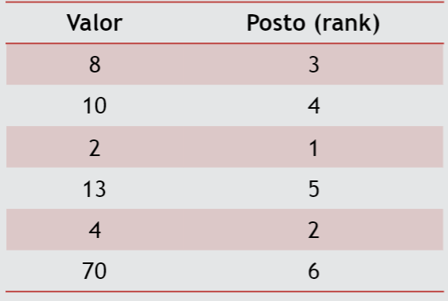

# Testes não paramétricos {#nparam}

Nesse capítulo, vamos discutir alguns testes de hipóteses não paramétricos. 
Usaremos aqui já as informações sobre testes de hipóteses apresentadas em https://daslab-ufes.github.io/materiais/ no arquivo "Inferência Estatística". 

Os testes não paramétricos não fazem suposições a respeito da forma das distribuições e são baseados na ordem das observações. Os testes são construídos com base em seus postos na amostra. 

Considere os dados como exemplo:   8, 10, 2, 13, 4, 70.  Para obter os postos, primeiro ordene os dados e atribua a cada observação a sua posição:
```{r, echo=FALSE, fig.cap="Exemplo de posto", out.width = '80%'}

```

Como consequência, os testes não levam em conta a distância entre os valores, apenas a ordem. E se há um valor muito discrepante dos demais isso não afeta o teste.
        
        
Vamos discutir nesse capítulo três testes paramétricos para comprar dois grupos independentes (Mann-Whitney), dois grupos dependentes (Wilcoxon) e mais de dois grupos independentes (Kruskal-Wallis).

## Teste para comparação de dois grupos independentes

Considere que queremos comparar dois grupos com relação a uma variável quantitativa ou qualitativa ordinal. Um teste não paramétrico para a comparação dos dois grupos é o **Mann-Whitney**.

Como exemplo, considere que a obstetra do estudo sobre gemelares quer agora realizar uma análise apenas das gestações cuja gestante tenha até 21 anos. Vamos então carregar os pacotes que usaremos aqui, importar a base de dados e depois criar um novo objeto resultante da filtragem das gestantes mais novas. 


Primeiramente, vamos carregar os pacotes que usaremos aqui. 
```{r, eval=TRUE,include=TRUE,echo=TRUE,error=FALSE,message=FALSE}
library(readr) #leitor da base de dados csv
library(dplyr) #para manipulação de dados
library(tidyr) #para mudar formato da base de dados
library(summarytools) #para medidas descritivas
```

Importamos agora a base de dados gemelares e depois filtrar só as gestantes com até 21 anos. 

```{r, eval=TRUE,include=TRUE,echo=TRUE,error=FALSE,message=FALSE}
dados <- read_csv(file = "dataset/dados_completos.csv") #importando base de dados

dados_adoles <- filter(dados,idade<=21) #filtrando só as gestantes até 21 anos
str(dados_adoles) #ver as descrições das variáveis
```

Observamos que há $n=21$ observações na base de dados "dados_adoles". 

Agora, queremos comparar os grupos de progesterona e placebo com relação ao número de contrações. Ao observar a tabela de frequências do grupo, observamos que há apenas 9 observações no grupo placebo e 12 no grupo progesterona.

```{r, eval=TRUE,include=TRUE,echo=TRUE,error=FALSE,message=FALSE}
freq(dados_adoles$grupo,cumul=FALSE,report.nas=FALSE)
```

Vamos realizar o teste de Mann-Whitney. Para isso, a função que utilizamos é `wilcox.test` (não precisa instalar pacote). Essa função também será utilizada para comparação de grupos pareados e por isso precisamos informar ao R que, nesse caso, os grupos não são pareados ao colocar `paired=FALSE`.

```{r, eval=TRUE,include=TRUE,echo=TRUE,error=FALSE,message=FALSE,warning=FALSE}
wilcox.test(num_contra_ctg~grupo,data=dados_adoles,paired=FALSE)
```

Como podemos observar, o valor p é grande e não há indícios para rejeição da hipótese nula de igualdade da distribuição do número de contrações nos dois grupos. 


## Teste para comparação de dois grupos dependentes

Considere agora que temos dois grupos dependentes e queremos compará-los com relação a uma variável quantitativa ou qualitativa ordinal. A dependência entre os grupos pode ser devido a avaliar os mesmos indivíduos em dois momentos: antes e depois de uma intervenção. 

Como exemplo, queremos comparar o escore médio de EPDS (depressão) antes e depois do parto das gestantes mais novas (até 21 anos). O teste de hipóteses para a comparação de dois grupos dependentes é conhecido como  **teste de Wilcoxon**.  

A função no R é a mesma que utilizamos no teste anterior, mas agora informamos ao R que os grupos são pareados ao utilizar o argumento `paired=TRUE`.

```{r, eval=TRUE,include=TRUE,echo=TRUE,error=FALSE,message=FALSE,warning=FALSE}
wilcox.test(dados_adoles$epds_depois,dados_adoles$epds_antes,paired=TRUE)
```

Ao considerar o valor p do teste de Wilcoxon (0.01952), há indícios de diferença entre os dois momentos de avaliação do EPDS a um nível de significância de 5\%. 

## Teste para comparação de mais de dois grupos independentes

Em um cenário que queremos comparar uma variável quantitativa ou qualitativa ordinal de três ou mais grupos independentes, o teste não paramétrico é o teste de **Kruskal-Wallis**.

Agora apenas para as gestantes mais novas (dados_adoles), vamos  comparar os três grupos de orientação sobre amamentação no pré-natal (acompanhamento, só orientação e nenhuma orientação) em relação ao tempo de amamentação. A função do R é a `kruskal.test`. 

```{r, eval=TRUE,include=TRUE,echo=TRUE,error=FALSE,message=FALSE,warning=FALSE}
kruskal.test(tempo_amamentacao_meses~grupo_amamentacao,data=dados_adoles)
```

Como o valor p obtido é de 0.2776, não há indícios para rejeitar a hipótese de igualdade da distribuição do tempo de amamentação entre os três grupos. 

Em um cenário que a hipótese nula do teste de Kruskal-Wallis é rejeitada, precisaríamos encontrar onde está essa diferença indicada na hipótese alternativa de Kruskal-Wallis. Para isso, realizaria uma análise de múltiplas comparações 2 a 2 grupos. No R, essa análise pode ser feita por meio da função `pairwise.wilcox.test` (não precisa instalar pacote).  


