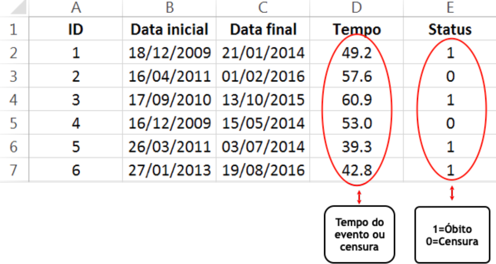

# Análise de sobrevivência - uma introdução

A área de análise de sobrevivência estuda o tempo até a ocorrência de um evento de interesse. Esse evento de interesse pode ser: óbito do paciente, cura de uma doença, recidiva de uma doença, cliente pagar um empréstimo bancário, falha de um componente eletrônico, parto, entre outros. 

Um ponto importante é sempre ter muito bem definido qual é o evento de interesse e o ponto de partida. Se desejamos estudar o tempo até o óbito por câncer de pacientes submetidos à radioterapia, o evento é óbito por câncer e a origem é a data da realização da radioterapia. 

No entanto, podem acontecer ocorrências que impedem a observação do evento de interesse, por exemplo: perda de seguimento, óbito por outra causa, efeitos colaterais, término do estudo, recusa em continuar participando, etc. Chamamos de **censura** essas ocorrências que impossibilitam a observação do evento de interesse. 

Apesar de não observar o evento de interesse nesses cenários, temos uma informação bastante importante aí: o tempo do evento de interesse é maior que o tempo observado e essa informação deve ser levada em conta. Obviamente que não é considerada na análise como sendo o evento observado e por isso precisamos tabular os dados de maneira adequada para que o programa consiga identificar se cada observação foi o evento de interesse ou se censura. Na Figura abaixo está um exemplo de como tabular os dados:

```{r, echo=FALSE, fig.cap="Exemplo de tabulação para dados de sobrevivência.", out.width = '100%'}

```
 
No R, há dois pacotes muito úteis para analisar dados de sobrevivência: `survival` e `survminer`. Vamos então carregar esses pacotes (já instalados na minha máquina):
```{r, eval=TRUE,include=TRUE,echo=TRUE,error=FALSE,message=FALSE}
library(survival) # para análise de sobrevivência
library(survminer) # para análise de sobrevivência
```

No pacote `survival` tem uma base de dados salva chamada de `lung`, constituída de pacientes com câncer de pulmão avançado e o evento é o óbito. Se você rodar o código `help(lung)` vai aparecer a documentação dessa base de dados. Para carregar a base de dados, usamos a função `data`:
```{r, eval=TRUE,include=TRUE,echo=TRUE,error=FALSE,message=FALSE}
data(lung)
```
Agora sim: no objeto "lung" está a base de dados que vamos analisar. São as variáveis dessa base:

- _inst_: código da instituição;

- _time_: tempo de sobrevida (em dias);

- _status_: status de evento e censura -  1 = censurado e 2 = óbito;

- _age_: idade em anos;

- _sex_: sexo - 1 = masculino e 2 = feminino;

- _ph.ecog_: Score de desempenho ECOG avaliado pelo médico - 0 = assintomático, 1 = sintomático, mas completamente deambulador, 2 = na cama <50\% do dia, 3 = na cama >50\% do dia, mas não confinado à cama e 4 = confinado à cama (não tem nenhum caso na amostra na categoria 4);

- _ph.karno_: Pontuação de desempenho de Karnofsky  avaliado pelo médico (ruim=0-bom=100);

- _pat.karno_: Pontuação de desempenho de Karnofsky informado pela(o) paciente;

- _meal.cal_: Calorias consumidas nas refeições;

- _wt.loss_: Perda de peso nos últimos seis meses. 
 
Antes de começar as análises, vamos colocar labels nas variáveis categóricas por meio da função `factor`:

```{r, eval=TRUE,include=TRUE,echo=TRUE,error=FALSE,message=FALSE}
lung$sex <- factor(lung$sex, 
                     levels = c("1", "2"), 
                     labels = c("Mas", "Fem"))

lung$ph.ecog <- factor(lung$ph.ecog, 
                     levels = c("0", "1", "2", "3"), 
                     labels = c("Assin", "Deamb","Cama_menor50","Cama_maior50"))
```

Uma primeira análise é estimar a curva de sobrevida. Um estimador não paramétrico para estimar a curva de sobrevivência na presença de dados censurados é o estimador de Kaplan-Meier (KM). 
Vamos fazer as curvas de KM por sexo. Para isso, usamos a função `survfit` do pacote `survival`. Atribuimos o ajuste ao objeto "ajuste_sexo" para poder fazer tabelas e gráficos que usam esse objeto como argumento.  

```{r, eval=TRUE,include=TRUE,echo=TRUE,error=FALSE,message=FALSE}
ajuste_sexo <- survfit(Surv(time = time, event = status) ~ sex, data = lung)

#Para fazer a tabela da estimativa de KM e intervalo de confiança:
surv_summary(ajuste_sexo, data = lung)
```

Alguns comentários importantes: 1) No argumento `event=` é especificada a variável indicadora de evento e censura. O menor valor dela é entendido como censura e o maior como sendo o evento. No exemplo, censura é 1 e óbito (evento) é 2. 
2) A variável indicadora de evento e censura precisa ser numérica (não texto). 

Para checar se o R está entendendo certo quem é evento e quem é censura, rode o seguinte código:
```{r, eval=TRUE,include=TRUE,echo=TRUE,error=FALSE,message=FALSE}
Surv(time = lung$time, event = lung$status)
```
Ao lado do número, o R coloca uma cruz ao lado do número que ele entende como censura. 

Agora vamos construir as curvas de KM por meio da função `ggsurvplot` do pacote `survminer`: 

```{r, eval=TRUE,include=TRUE,echo=TRUE,error=FALSE,message=FALSE}
ggsurvplot(ajuste_sexo, data = lung,
           pval = TRUE, conf.int=TRUE, conf.int.style = "step",
           ylab = "Sobrevida", xlab = "tempo em dias", legend.title = "Sexo")  
```

Além da estimativa pontual, também plotamos o intervalo com 95\% de confiança para a sobrevida em cada tempo, ao considerar o argumento `conf.int=TRUE`. Podemos também identificar a sobrevida mediana, ou seja, o tempo em que foi observado a ocorrência do evento de interesse em 50\% dos indivíduos, ao utilizar o argumento `surv.median.line = "hv"`: 
```{r, eval=TRUE,include=TRUE,echo=TRUE,error=FALSE,message=FALSE}
ggsurvplot(ajuste_sexo, data = lung,
           pval = TRUE, conf.int=TRUE, conf.int.style = "step",
           ylab = "Sobrevida", xlab = "tempo em dias", legend.title = "Sexo", surv.median.line = "hv")  
```

Também podemos incluir no gráfico a tabela de indivíduos sob risco e também a tabela com a distribuição de censura ao longo do tempo. Para a tabela de risco, são os argumentos que começam com `risk` e para a tabela da censura é `ncensor.plot`. Veja o comando a seguir:
```{r, eval=TRUE,include=TRUE,echo=TRUE,error=FALSE,message=FALSE}
ggsurvplot(ajuste_sexo, data = lung,
           pval = TRUE, conf.int=TRUE, conf.int.style = "step",
           ylab = "Sobrevida", xlab = "tempo em dias", legend.title = "Sexo", surv.median.line = "hv",
  risk.table = "abs_pct",  # absolute number and percentage at risk.
   risk.table.y.text.col = T,# colour risk table text annotations.
  risk.table.y.text = FALSE,# show bars instead of names in text annotations in legend of risk table. 
  ncensor.plot = TRUE)
```

Nos três gráficos acima pedimos para printar o valor p da comparação das curvas dos dois sexos (`pval=TRUE`). Esse valor p é do teste de Log-Rank usado para a comparação de curvas de sobrevivência de dois ou mais grupos. A hipótese nula do teste é de igualdade das curvas. 

Podemos também obter as saídas do teste de Log-Rank em uma tabela, por meio do seguinte código:

```{r, eval=TRUE,include=TRUE,echo=TRUE,error=FALSE,message=FALSE}
survdiff(Surv(time = time, event = status) ~ sex, data = lung) 
```

Pelas saídas acima, há indícios de diferença entre as curvas de sobrevida dos sexos. 

Podemos também ajustar um modelo de regressão para explicar o risco da ocorrência do evento de interesse considerando uma ou mais variáveis explicativas. Um modelo muito utilizado é o **modelos de riscos proporcionais de Cox**. Nesse modelo, assume-se que a taxa de falha (risco) tem a seguinte forma:
 $$
 \lambda(t) = \lambda_0(t) \exp\{\beta_1x_1 + \ldots + \beta_p x_p\},  \nonumber
 $$
 em que $x_j$ representa a $j$-ésima covariável (variáveis explicativas), com $j=1,\ldots,p$.

O componente não paramétrico, $\lambda_0(t)$, é uma função não negativa do tempo, chamada de função basal. O modelo de regressão de Cox é caracterizado pelos coeficientes $\beta$'s, que medem os efeitos das covariáveis sobre a função de risco.

Suponha, sem perda de generalidade, que $p=1$. A razão dos riscos (_hazard ratio_ - HR) de dois indivíduos diferentes $i$ e $j$ é
$$
 \frac{\lambda_i(t)}{\lambda_j(t)} = \frac{\lambda_0(t) \exp\{\beta_1x_{1i}\}}{\lambda_0(t) \exp\{\beta_1x_{1j}\}}=\exp\left\{\beta_1(x_{1i}-x_{1j})\right\},  \nonumber
$$
 que não depende do tempo. Se a covariável for binária, ser ou não hipertensa, por exemplo, e $x_{1i}=1$ (ser hipertensa) e $x_{1j}=0$ (não ser hipertensa), então o $HR=\exp(\beta_1)$.
 
  Assim, se um indivíduo no início do estudo tem um risco de morte igual a duas vezes o risco de um segundo indivíduo, então esta
razão de riscos será a mesma para todo o período de
acompanhamento.

Vamos ajustar o modelo de Cox para os dados "lung" por meio da função `coxph` do pacote `survival`:

```{r, eval=TRUE,include=TRUE,echo=TRUE,error=FALSE,message=FALSE}
ajuste_cox <- coxph(Surv(time = time, event = status) ~ age + sex + ph.ecog + ph.karno + pat.karno + meal.cal + wt.loss, data = lung)
```
 
Atribuímos ao objeto "ajuste_cox" o modelo de Cox ajustado ao considerar como covariáveis todas as variáveis escritas após $\sim$ e separadas pelo símbolo +. 

Para ver a saída do modelo, utilizamos a função `summary`:
```{r, eval=TRUE,include=TRUE,echo=TRUE,error=FALSE,message=FALSE}
summary(ajuste_cox)
```

O valor p na tabela acima é denotado por `Pr(>|z|)` e o _hazard ratio_ (HR) é dado por `exp(coef)` e o intervalo com 95\% de confiança para HR é `lower .95` e  `upper .95`. 

Ao considerar um nível de 5\% de significância, são significativas as variáveis "sex" e "ph.ecog". Vamos interpretar a saída para a variável sexo: como está escrito "sexFem", a categoria de referência é o sexo masculino. O HR estimado é de 0.58, indicando que o sexo feminino apresenta menor risco e que o risco de óbito do sexo masculino é 1.72 vezes maior que o risco do sexo feminino. Podemos observar que o 1 não está contido no intervalo com 95\% de confiança para HR (0.39; 0.86), o que é equivalente a observar que o valor p é menor que 5\% de significância. 

Também podemos apresentar os resultados por meio de um gráfico de floresta (_forest plot_), obtido da seguinte maneira:
```{r, eval=TRUE,include=TRUE,echo=TRUE,error=FALSE,message=FALSE}
ggforest(ajuste_cox, data = lung)
```

Aqui vale um comentário muito importante: o modelo de Cox faz a suposição que os riscos são proporcionais. Essa suposição pode ser verificada através do teste baseado nos resíduos Schoenfeld e na análise gráfica desses resíduos.

A hipótese nula do teste de proporcionalidade é que os riscos são proporcionais. No R, para realizar o teste, rodamos o seguinte código:
```{r, eval=TRUE,include=TRUE,echo=TRUE,error=FALSE,message=FALSE}
teste_prop <- cox.zph(ajuste_cox)
teste_prop
```
Apesar do teste global não rejeitar a hipótese de proporcionalidade a um nível de 5\% de significância, os testes marginais para "ph.karno" e "meal.cal" rejeitaram a hipótese de proporcionalidade.

Além dos testes, podemos realizar uma análise gráfica dos resíduos de Schoenfeld. Sob a hipótese de proporcionalidade, espera-se que os pontos dos gráficos sejam distribuídos aleatoriamente, sem nenhuma tendência.
```{r, eval=TRUE,include=TRUE,echo=TRUE,error=FALSE,message=FALSE}
ggcoxzph(teste_prop)
```

Além de verificar a suposição de proporcionalidade, também é necessário verificar se há valores influentes (outliers com peso muito importante) no ajuste. Para mais informações, veja: http://www.sthda.com/english/wiki/cox-model-assumptions.


